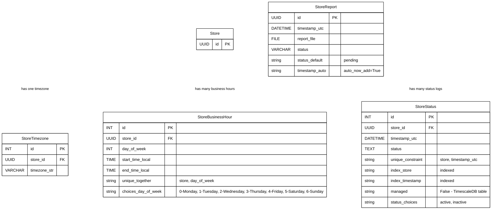
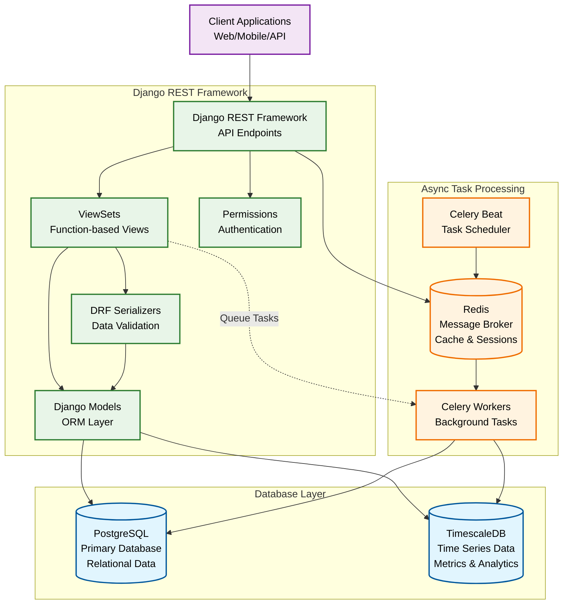

# 🏪 Store Uptime Monitoring System

A Django-based backend system for monitoring the uptime and downtime of multiple stores. It uses **TimescaleDB** for efficient time-series data storage, **Celery** for background processing, and **Redis** as the task broker. The system generates uptime reports (CSV) for the last hour, day, and week.

---

## 🗂️ Project Structure

<details>
<summary>Click to expand</summary>

```text
loop/
├── loop_project/
│   ├── __init__.py
│   ├── settings.py
│   ├── urls.py
│   └── wsgi.py
│
├── store_monitor/
│   ├── admin.py
│   ├── apps.py
│   ├── models.py
│   ├── serializer.py
│   ├── tasks.py
│   ├── urls.py
│   ├── utils.py
│   ├── views/
│   │   ├── __init__.py
│   │   ├── report.py
│   │   └── test.py
│   └── migrations/
│
├── media/
│   └── reports/
│       └── store_report_<id>.csv
│
├── manage.py
└── README.md
```

</details>

---

## 🚀 Features

* Track uptime/downtime per store for the last:

  * Hour (in minutes)
  * Day (in hours)
  * Week (in hours)
* Support for per-store timezones and business hours
* Generate CSV reports on demand or via scheduled jobs
* Asynchronous background processing using Celery
* Store reports locally under `media/reports/`
* REST API to trigger and fetch reports
* Average time taken to generate report : 26.132088786000168seconds

---

## ⚙️ Tech Stack

* **Backend:** Django + Django REST Framework
* **Database:** PostgreSQL + TimescaleDB
* **Task Queue:** Celery
* **Broker:** Redis
* **Scheduler:** django-celery-beat
* **File Storage:** Local media directory (`media/reports/`)

---
ER Diagram for our Database

---
## 🛠️ Setup Instructions

### 1. Clone the repository

```bash
git clone <your-repo-url>
cd loop
```

### 2. Install dependencies

```bash
python -m venv .venv
source .venv/bin/activate
pip install -r requirements.txt
```

### 3. Configure environment variables (`.env`)

Example:

```env
DEBUG=True
CELERY_BROKER_REDIS_URL=redis://localhost:6379
```

Make sure PostgreSQL + TimescaleDB and Redis are running locally.

### 4. Apply database migrations

```bash
python manage.py makemigrations
python manage.py migrate
```

### 5. Start services

#### Django server

```bash
python manage.py runserver
```

#### Celery worker

```bash
celery -A loop_project worker -l info
```

#### Celery beat (optional, for scheduling tasks)

```bash
celery -A loop_project beat -l info
```

---

## 🔹 PostgreSQL TimescaleDB Setup

Once connected to your database using `psql`, run the following commands to enable TimescaleDB and convert the `store_monitor_storestatus` table to a hypertable:

```sql
-- Enable the TimescaleDB extension
CREATE EXTENSION IF NOT EXISTS timescaledb;

-- Convert the table to a hypertable
SELECT create_hypertable('store_monitor_storestatus', 'timestamp_utc', if_not_exists => TRUE);
```

---
